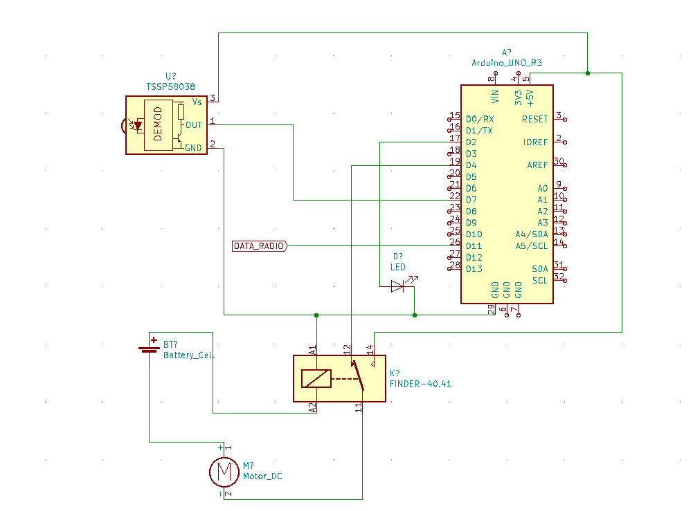
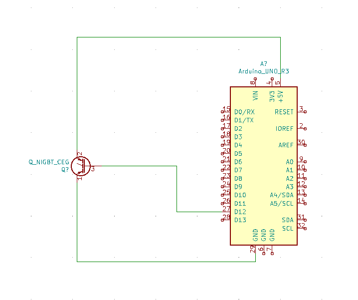

% **Notice de montage et d'utilisation du BallBot**
% 3 juin 2019
% Equipe 46

# Notice de montage
## Assemblage de la boite

\pagebreak
## Circuit electrique
### Circuit de l'Arduino située dans le BallBot
L'Arduino située dans le BallBot contrôle le moteur et attends un signal radio
grâce au récepteur radio.




\pagebreak
## Code informatique
### Code pour l'Arduino située dans le BallBot

```c
// Librairies
#include "Ultrasonic.h" // Librairie fournie pour controler le moteur
#include <RH_ASK.h> // Librairie RadioHead pour le recepteur-emetteur radio
#include <SPI.h> // Librairie necessaire a RadioHead pour compiler

// PINS
int pin_distance_sig = 7; // pin sig du capteur de distance
int pin_relay = 4; // pin du module de relais
int pin_led = 2; // pin de la led

// Initialisation de l'objet ultrasonic pour pouvoir controler le moteur
Ultrasonic ultrasonic(pin_distance_sig);
// Initialisation de l'objet rf_driver pour recevoir des donnees par radio
RH_ASK rf_driver;

void setup() {
  pinMode(pin_relay, OUTPUT);
  pinMode(pin_led, OUTPUT);
  rf_driver.init();
  Serial.begin(9600);
}

void loop() {
  long distance;
  distance = ultrasonic.MeasureInCentimeters();
  distance = 6;
  if (distance < 5) {
    digitalWrite(pin_led, HIGH);
  }
  else {
    digitalWrite(pin_led, LOW);
    uint8_t buf[1];
    uint8_t buflen = sizeof(buf);
    if (rf_driver.recv(buf, &buflen))
    {
      Serial.println("Activation du mecanisme de jet de balle");
    }
    if (*buf == 1) {
      digitalWrite(pin_relay, 1);
      delay(200);
    }
    else {
      digitalWrite(pin_relay, 0);
      delay(200);
    }
  }
}
```

### Code de l'Arduino "bracelet"

```c
// Librairies
#include <RH_ASK.h> // Librairie RadioHead pour le recepteur-emetteur radio
#include <SPI.h> // Librairie necessaire a RadioHead pour compiler

// PINS
int pin_bouton = 7;

int valeur_bouton = 0;

// Initialisation de l'objet rf_driver pour recevoir des donnees par radio
RH_ASK rf_driver;

void setup() {
  rf_driver.init();
  pinMode(pin_bouton, INPUT);
}

void loop() {
  valeur_bouton = digitalRead(pin_bouton);
  if (valeur_bouton != 0)
  {
    uint8_t msg = 1;
    rf_driver.send((uint8_t *) msg, strlen(msg));
    rf_driver.waitPacketSent();
    delay(1000);
  }
}
```

## Liens utiles

- [Librairie RadioHead](https://www.airspayce.com/mikem/arduino/RadioHead/)
- [Librairie Ultrasonic](https://github.com/Seeed-Studio/Grove_Ultrasonic_Ranger/archive/master.zip)
- [Code open-source](https://github.com/louiswolfers/pix2)
